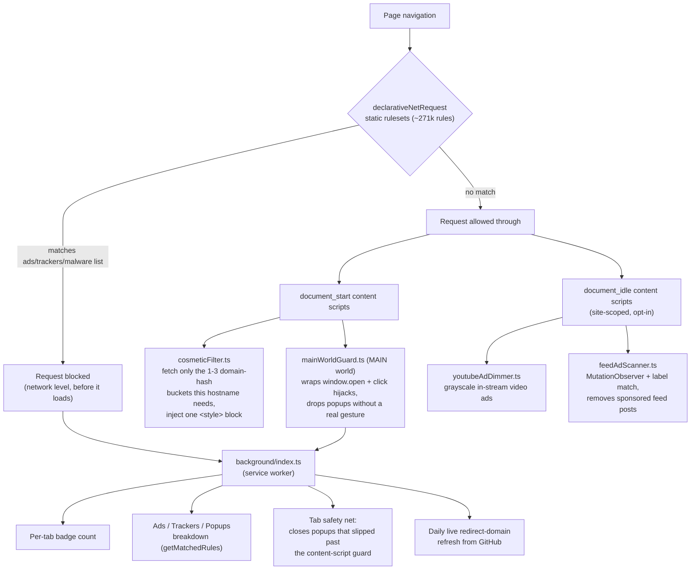

<p align="center">
  
</p>

<h1 align="center">Moat</h1>
<p align="center"><strong>A quiet ad blocker and popup/redirect firewall for Chrome and Firefox.</strong></p>

<p align="center">
  <a href="https://github.com/Samuelabhinav37/moat/actions/workflows/ci.yml"></a>
  
  
</p>

No nag screens, no "rate us" prompts, no onboarding tabs. It blocks things quietly and shows a
badge count.

> **Project status:** active development. Builds and automated tests cover Chrome and Firefox,
> but browser-store review, real-world compatibility, filter provenance, and dependency review
> remain part of every release decision.

## Contents

- [What it does](#what-it-does)
- [Install & build](#install--build)
- [Architecture at a glance](#architecture-at-a-glance)
- [How it works](#how-it-works)
- [Permissions](#permissions)
- [Enterprise deployment](#enterprise-deployment)
- [Known limitations](#known-limitations)
- [Licensing note](#licensing-note)
- [Researched but not built yet](#researched-but-not-built-yet)
- [`docs/design-notes.md`](docs/design-notes.md) — deeper mechanics and the investigation log
- [`PRIVACY.md`](PRIVACY.md) — full privacy policy

## What it does

- **Network-level blocking** — ~271,000 rules across 20 static rulesets: 11 AdGuard filter lists
  (ads, trackers, known-malicious/phishing/scam domains, cookie notices, other annoyances) plus
  Moat's own small rulesets (Global Privacy Control header, URL-tracking gap fixes, tracker
  coverage-gap fixes). Counts drift with each filter-list update.
- **Popup/redirect firewall** — silently drops hijacked new-tab popups and redirects, backed by a
  background tab safety net.
- **Cosmetic filtering** — hides the leftover ad containers and cookie banners that network-level
  blocking can't reach.
- **Real block-count breakdown** — the toolbar popup shows an Ads / Trackers / Popups split from
  the browser's own rule-match feedback, not estimates (Chrome only for now), plus a qualitative
  read ("Light"/"Moderate"/"Heavy tracking blocked") and an optional "by company" attribution,
  expanded in Settings → Trackers with a one-sentence description per company.
- **Element picker** — "Block an element…" for anything the filter lists miss: hide it
  permanently, hide it just for this page load, or gray it out if hiding would break the layout.
- **Grayed-out video ads** — dims YouTube's in-stream ads instead of leaving them full-color,
  since they play through the same player as real content and can't be blocked outright. On by
  default, best-effort. YouTube's sidebar "Sponsored" cards are hidden outright instead.
- **Aggressive feed ad removal** (opt-in) — a live scanner for Instagram, LinkedIn, and YouTube
  that removes sponsored posts by their rendered "Sponsored"/"Ad"/"Promoted"/"Paid partnership"
  label, since feeds randomize class names specifically to defeat fixed selectors.
- **Auto-reject cookie banners** (opt-in) — clicks through to "reject"/"decline" on the major
  consent platforms (OneTrust, Cookiebot, Didomi, and others) using a small interpreter for a
  declarative rule format, never arbitrary injected JS.
- **Uncloak disguised trackers** (Firefox only, opt-in) — resolves CNAME-cloaked first-party
  subdomains and blocks the ones that lead to a known tracker.
- **Per-site pause + master switch** — no nag UI anywhere.
- **Opt-in privacy toggles** — fingerprint resistance, third-party cookie blocking, and WebRTC
  leak protection, all off by default.
- **Filtering levels** — Off / Lite / Essential / Standard / Strict presets, plus per-list control.
- **Custom rules** — your own block and allow lists, on top of the bundled filter lists.
- **Enterprise-managed policy** — push settings org-wide via Chrome's `ExtensionSettings` or
  Firefox's `policies.json`.
- **Global Privacy Control** — sent as a legally binding opt-out signal in a dozen US states.
- **Leaked-password check** (opt-in) — warns inline when a password you type into a page has
  appeared in a known data breach, via HaveIBeenPwned's k-anonymity API (only a 5-character hash
  prefix ever leaves your device, never the password itself).
- **Settings export/import and opt-in cross-device sync** — back up your settings as a file, or
  mirror them across your own devices via `storage.sync`, both off by default.
- **Keyboard shortcut** (default Ctrl+Shift+M / Cmd+Shift+M) — toggle protection globally without
  opening the popup.
- **"Report a problem" button** — opens a pre-filled GitHub issue with just the site's hostname
  and your enabled filter groups, never the full URL.
- **Localization** — English, Spanish, French, and German (the latter three are first-draft
  machine translations, provisional).
- One codebase, Chrome and Firefox builds.

## Install & build

```
npm install
npm run filters:update   # pulls the AdGuard DNR rulesets into rules/dnr/
npm run validate:rules   # sanity-checks them (schema, duplicate ids)
npm run build            # builds dist/chrome and dist/firefox
```

Re-run `npm run filters:update` periodically to pick up newer filter rules (the underlying
package publishes frequently). It runs `update-filters.mjs` (copies the prebuilt DNR rulesets out
of `node_modules`, no network) then `update-cosmetics.mjs` (downloads the raw filter-list text
from AdGuard's CDN to extract cosmetic rules — this one needs network access, including in CI).

- `npm run dev:chrome` / `npm run dev:firefox` — rebuild on file changes. Static assets (icons,
  rulesets, manifest) are copied once at watch startup, so re-run the plain build if those change.
- `npm run test` — Vitest unit suite: the popup-firewall heuristic, the redirect-domain matcher,
  the filter chunking, the Chrome/Firefox privacy-API branching, the match-rule-to-category
  mapping behind the popup breakdown, and the managed-schema shape.
- `npm run typecheck` — `tsc --noEmit`.
- `npm run zip` — produces `chrome.zip` and `firefox.zip` for store upload.
- `.github/workflows/ci.yml` runs all of the above plus the full build and the Firefox lint on
  every push. `.github/workflows/release.yml` builds a draft release on a `vX.Y.Z` tag.

`filters:update` also writes `live/redirect-domains.json` — unlike `rules/dnr/` (build output,
gitignored), this one is tracked: committing and pushing it is how a refreshed redirect-domain
list reaches already-installed copies without a new store release (see
[Live updates](#how-it-works)).

### Loading it unpacked

- **Chrome / Edge / Brave:** open `chrome://extensions`, enable Developer mode, click "Load
  unpacked", and select `dist/chrome`.
- **Firefox:** open `about:debugging#/runtime/this-firefox`, click "Load Temporary Add-on", and
  select `dist/firefox/manifest.json`. (Temporary add-ons are removed when Firefox restarts; a
  persistent local install needs AMO signing, even for self-distribution.)

## Architecture at a glance



Network-level blocking (left branch) happens before a request ever loads. Everything else is
reactive to a page that already loaded — cosmetic hiding, the popup guard, and the opt-in
per-site features all run as content scripts, while the background service worker owns anything
that needs to persist across pages (the badge, the breakdown, the safety net, live updates).

## How it works

Only the parts that need more than a sentence. Feature-level mechanics — the feed scanner, the
consent interpreter, CNAME uncloaking, the fingerprint noise, the cosmetic-filtering internals —
are in [`docs/design-notes.md`](docs/design-notes.md).

- **Network blocking** — ships `declarativeNetRequest` static rulesets refreshed from
  `@adguard/dnr-rulesets`: 11 AdGuard lists (Base, Tracking Protection, URL Tracking, and Popups
  for ads/trackers; Online Malicious URL, Phishing URL, Scam, and Badware-risks for actual
  malware/phishing domains — the "firewall" half, which blocks known-bad sites outright, not just
  ads; Social Media, Cookie Notices, and Other Annoyances for the rest), plus three small
  first-party rulesets: the `Sec-GPC` header rule (`ruleset_privacy-headers`), ClearURLs-gap
  URL-tracking params (`ruleset_url-tracking-extra`), and block rules for a handful of
  error-reporting and social ad/conversion endpoints the bundled lists miss
  (`ruleset_trackers-extra`). ~271,000 rules across 20 rulesets, well under the ceiling for most
  installs (see [Known limitations](#known-limitations)), all running in the browser engine, not a
  JS handler (which MV3 no longer allows for blocking). A slice are `$redirect` rules that point
  ad scripts at a bundled no-op resource (`nooptext.js`, `1x1-transparent.gif`, etc.);
  `scripts/update-filters.mjs` vendors the ~30 resource files those rules reference out of
  `@adguard/scriptlets` into `web-accessible-resources/redirects/` so they resolve instead of
  failing closed.
- **Block-count breakdown** — the popup's Ads/Trackers/Popups strip is sourced from
  `declarativeNetRequest.getMatchedRules()` (the `declarativeNetRequestFeedback` permission),
  refreshed once per page load and mapped from the filter-list groups to three buckets. Real
  counts, starting at zero on a fresh page and filling in as the page's own requests get matched.
  Chrome-only: Firefox hasn't implemented `getMatchedRules`, so that slice stays at zero there
  while the popup/redirect firewall count still works on both browsers. A collapsed-by-default "By
  company" disclosure attributes as many matches as it can to the organization behind them,
  correlated at build time against Ghostery's TrackerDB by target domain
  (`scripts/lib/ruleCompany.mjs`), hidden entirely where TrackerDB has no data; Settings → Trackers
  shows the same list for the last tab you had open, each company with a one-sentence description
  and link (also from TrackerDB, `rules/dnr/company-info.json`). A qualitative line
  (`src/shared/protectionLevel.ts`) buckets the same count into "Light"/"Moderate"/"Heavy tracking
  blocked" — deliberately not a before/after grade, since Moat has no counterfactual for what a
  page would have loaded without it.
- **Popup/redirect firewall** — a content script injected into the page's own JS context
  (`world: "MAIN"`) wraps `window.open` and intercepts script-dispatched clicks on
  `target="_blank"` links. A new tab opens only when there's a genuine, recent, on-target user
  gesture behind it (`navigator.userActivation` plus the actual clicked element, not just "some
  click happened somewhere recently"). Everything else is dropped silently — no browser
  popup-blocked notification bar. In case one slips past the content script (a frame the script
  never ran in, a race), the background worker watches newly created tabs and silently closes any
  that land on a domain from the AdGuard Popups/URL Tracking lists.
- **Cosmetic filtering** — network blocking is network-only, so a build-time script
  (`scripts/update-cosmetics.mjs`) parses standard `##selector` / `#@#`-exception cosmetic rules
  out of the raw filter lists (skipping scriptlet and extended-selector syntax that needs a JS
  engine), validates every selector against jsdom, and buckets per-domain selectors into 64 shard
  files by a hash of the domain. A content script (`src/content/cosmeticFilter.ts`, top frame
  only) fetches only the 1–3 shards its hostname hashes into and injects them as `<style>` blocks
  at `document_start` — CSS rules, not a one-time DOM pass, so they keep working through SPA
  navigation without a MutationObserver. This cut the JSON fetched per page load from ~5.8MB to
  under 1MB. The generic-selector cleanup pass and the sharding details are in the design notes.
- **Live updates + emergency quick-fix channel** — the bulk of blocking stays static (MV3's
  dynamic-rule budget can't hold ~271k rules), but two small lists refresh daily:
  `live/redirect-domains.json` (~460 popup/redirect domains) and `live/quick-fixes.json`, an
  AdGuard-"Quick Fixes filter"-style channel for patching an anti-adblock-circumvention script or
  a filter-breakage report without waiting on a full store review cycle.
  `src/background/liveUpdates.ts` fetches whatever's currently committed on GitHub and applies it
  as dynamic `declarativeNetRequest` rules on top of the bundled baseline. Publishing a refresh is
  just `npm run filters:update` + commit + push — no scheduled automation writes to the repo.
  Trust here is GitHub account security plus TLS, with no extra signature/hash pinning; a
  quick-fix entry can only block a request, allow-list one, or strip query params
  (`src/background/quickFixRules.ts`), never redirect to an arbitrary URL, so a compromised feed
  can't turn this into traffic hijacking. Both are empty by default and Settings shows the last
  successful check.
- **Enterprise-managed policy** — an admin can push settings org-wide via Chrome's
  `ExtensionSettings` policy or Firefox's `policies.json` `3rdparty` key (schema:
  `src/managed_schema.json`): force protection on, lock the filter-list toggles, or add an
  org-wide blocklist on top of whatever the user has already added. Locked controls show a
  "Managed by your organization" badge instead of silently overriding the user. See
  [Enterprise deployment](#enterprise-deployment).

For the source layout and the "pure, directly-tested module behind a thin browser-API wrapper"
pattern the heuristics follow, see [`docs/design-notes.md`](docs/design-notes.md). `CHANGELOG.md`
has per-version history; the in-extension About tab (Settings → About) has a shorter version plus
the privacy policy.

## Permissions

| Permission | Why |
| --- | --- |
| `<all_urls>` (host permission) | So the content-script firewall runs on every page and `declarativeNetRequest` can act on every request. |
| `tabs` | To read the URL/opener of newly created tabs for the popup safety net, and to show the right badge count per tab. |
| `webNavigation` | To detect when a page spawns a new tab/window, and when a page finishes loading (to refresh the block-count breakdown). |
| `declarativeNetRequest` | The core network-blocking engine. |
| `declarativeNetRequestFeedback` | Read-only match feedback for the popup's Ads/Trackers/Popups breakdown (`getMatchedRules`) — Chrome only, see "How it works" above. |
| `storage` | The paused-sites list and switches, stored locally only. Nothing is sent anywhere. |
| `privacy` | Only used by the opt-in toggles above; unused (and invisible to the user) unless one is turned on. |
| `alarms` | Schedules the once-a-day live redirect-domain-list refresh. |
| `dns` (Firefox only) | Real CNAME resolution for "Uncloak disguised trackers" — off by default, and the permission itself has no effect unless that toggle is on. Not requested on Chrome, which has no equivalent API. |
| `webRequest` + `webRequestBlocking` (Firefox only) | Needed to actually cancel a request once its resolved CNAME target matches a known tracker — `declarativeNetRequest` can't act on an async DNS lookup mid-request. Chrome no longer allows blocking `webRequest` under MV3 at all; Firefox still does. |

See [PRIVACY.md](PRIVACY.md) for the full privacy policy: what data Moat collects (none, ever, for
any normal install) and every case where its own code talks to a network at all.

## Enterprise deployment

An admin can push policy via Chrome's `ExtensionSettings` policy (Group Policy / Chrome Browser
Cloud Management) or Firefox's `policies.json` `3rdparty` key, targeting this extension's id and
setting values matching `src/managed_schema.json`. Chrome example (`ExtensionSettings` policy
value, keyed by extension id):

```json
{
  "<extension-id>": {
    "installation_mode": "force_installed",
    "update_url": "https://clients2.google.com/service/update2/crx",
    "policy": {
      "forceEnabled": true,
      "lockFilterGroups": true,
      "managedFilterGroups": { "ads": true, "trackers": true, "malicious-urls": true },
      "managedCustomBlockedDomains": ["known-bad-domain.example"]
    }
  }
}
```

The Firefox equivalent goes under `3rdparty.Extensions["<extension-id>"]` in `policies.json` with
the same `policy` object shape. This was built and unit-tested against the documented policy
mechanism but not verified against a real managed browser profile — worth a manual check
(`chrome://policy` shows whether Chrome picked up the value) before relying on it in production.

### Athena integration (enterprise-only, off for every other install)

Moat ships the client half of an optional integration with
[Athena](https://github.com/Samuelabhinav37/Athena), a self-hosted identity-governance platform.
It has **no Settings toggle** and cannot be turned on by a user at all; it only exists to be
provisioned by an organization's own device-management policy, and every normal, personal, or
open-source install of Moat behaves exactly as documented everywhere else in this README with it
entirely absent. Background on where this fits a wider design, and why network-path enforcement,
TLS inspection, per-user authenticated logging, and tamper resistance are deliberately *not* in
scope for a browser extension:
[`docs/research/enterprise-web-control-landscape.md`](docs/research/enterprise-web-control-landscape.md).

Add an `athena` object (see `src/managed_schema.json`) to the same managed policy shown above:

```json
"policy": {
  "athena": {
    "tenantId": "acme",
    "agentId": "<agent id returned by Athena enrollment>",
    "bootstrapUrl": "https://athena.acme.example/v1/security/agent-token",
    "bootstrapSecret": "<provisioned by your Athena deployment, scoped to this org only>",
    "eventsUrl": "https://athena.acme.example/v1/security/events",
    "policyUrl": "https://athena.acme.example/v1/security/policies/latest",
    "policyPublicKey": { "kty": "OKP", "crv": "Ed25519", "x": "<base64url key>" }
  }
}
```

Once present, `src/background/athenaIntegration.ts` exchanges `bootstrapSecret` for a short-lived
session token (cached in `browser.storage.session` — in-memory, never `local`/`sync`) and every
five minutes flushes a bounded local queue as individual idempotent security events: one for each
request already blocked by the malicious-urls/phishing-urls/scam/badware lists specifically (not
ordinary ads/trackers, which never generate an event), one for each popup/redirect-firewall catch
(the one source that also works on Firefox), and one for every "Report mistake" override on the
warning page. Every event carries a category, a risk tier, a timestamp, and the matched domain —
resolved from the bundled ruleset (`background/securityRuleDomain.ts`), read off the intercepted
request, or the policy-known hostname Athena itself named; never the full URL, page content, or
browsing history. Blocking itself never waits on any of this: by the time an event is queued, the
block it describes has already happened locally, and a flush failure just leaves the queue for the
next attempt. Policy artifacts are verified with the managed Ed25519 public key before Moat
changes any dynamic rule; invalid or unreachable updates retain the last-known-good rules, and an
Athena-sourced block uses a separate warning page where a reported mistake stays an audited
request rather than an immediate local bypass.

## Known limitations

- **The block-count breakdown is Chrome-only.** Firefox hasn't implemented
  `declarativeNetRequest.getMatchedRules()` yet, so the Ads/Trackers/Popups strip stays at zero
  there. The popup/redirect firewall count (the "Popups" bucket's other half) still works on both
  browsers.
- **CNAME-cloaked tracker uncloaking is Firefox-only, the other direction.** Chrome has no
  DNS-resolution API for extensions at all — not a missing permission, no such capability exists
  to request. "Uncloak disguised trackers" in Settings simply isn't offered there.
- **The YouTube ad dimmer is a DOM heuristic, not a guarantee.** It checks two independent signals
  (see the design notes), which makes it more resilient than relying on one, but it still depends
  on YouTube's current markup. YouTube changes its markup periodically without notice; when it
  does, this can silently stop matching until it's updated. On by default since it's visual-only
  and doesn't break anything if it misfires — turn it off in Settings if it ever does.
- **The aggressive feed scanner only catches a label that renders as one plain, isolated text
  node.** If Instagram or YouTube ever split "Sponsored" across multiple `<span>`s the way
  Facebook is known to, this stops catching it until that's accounted for. It's also English-only
  right now. Off by default for these reasons, on top of the general false-positive risk of
  matching by label rather than by a fixed selector.
- **Chrome only guarantees 30,000 enabled static DNR rules per extension
  (`GUARANTEED_MINIMUM_STATIC_RULES`); Moat ships ~271,000 across its 20 rulesets** (this exact
  number drifts with every `@adguard/dnr-rulesets` update — see `npm run filters:update`'s own
  output for the current count; already-redundant rules are pruned at build time, see
  `docs/research/dnr-rule-consolidation-audit.md`). Rules beyond that guaranteed floor come from a
  pool shared across every extension installed in the browser, so on a machine running several
  other rule-heavy ad blockers or privacy extensions — or where that shared pool is simply small
  — some of Moat's filter lists can fail to enable. `declarativeNetRequest.updateEnabledRulesets()`
  is atomic, so `src/background/filterGroups.ts` retries with the least-essential lists dropped
  first (annoyance/cosmetic categories, then ads/trackers, security last) until something fits,
  rather than an all-or-nothing failure leaving every list disabled. The Filter Lists tab then
  shows exactly which lists were left disabled, and each affected row gets a "Not active (rule
  budget)" badge — never a toggle silently shown as "on" while doing nothing. A genuinely fresh
  install (`browser.runtime.onInstalled` with `details.reason === "install"`) seeds the much
  smaller "Lite" preset (~85,000 rules) instead of the implicit "every group on" default
  (~271,000 rules) specifically to make hitting this ceiling less likely from day one — see
  `applyFreshInstallDefaults` in `src/background/settings.ts`. Nothing raises the ceiling itself:
  it's a browser-wide, cross-extension limit.
- **`web-ext lint` warnings on the Firefox build are expected and benign:** one is a
  Firefox-for-Android version nuance from bumping `strict_min_version` to 140 for
  `data_collection_permissions` support; one (`COINMINER_USAGE_DETECTED`) is the linter's naive
  keyword scanner tripping over a cryptominer *domain name* inside the AdGuard Base filter's own
  block rules (static JSON blocking that domain, not code that runs it); and three
  (`UNSUPPORTED_API`) are the `getMatchedRules` gap above plus its debugging-tool cousin
  `onRuleMatchedDebug` — Firefox implements neither, and both are feature-detected before use, so
  these are dead references, not runtime failures.

## Licensing note

Moat's own code is licensed under [GPL-3.0](LICENSE) — chosen to match the license already
covering the bundled AdGuard/EasyList filter data below, so the whole distributed package sits
under one consistent copyleft license rather than mixing license families.

The bundled filter lists are distributed under GPL-3.0 by AdGuard/EasyList contributors. If you
publish this extension, keep the attribution above and check current license terms before
distributing `rules/dnr/*.json` — that data isn't original to this project.

The company names behind the popup's optional "By company" breakdown come from
[Ghostery's TrackerDB](https://github.com/ghostery/trackerdb) (`@ghostery/trackerdb`), licensed
[CC-BY-NC-SA-4.0](https://creativecommons.org/licenses/by-nc-sa/4.0/) — free for non-commercial
use, which Moat is. If that ever changes, this needs revisiting before shipping a build that still
includes `rules/dnr/rule-companies.json`.

The cookie-banner rule data behind "Auto-reject cookie banners" is vendored from
[Consent-O-Matic](https://github.com/cavi-au/Consent-O-Matic) (Aarhus University CAVI),
MIT-licensed. Moat's interpreter for that rule format (`src/content/consent/`) is written from
scratch against their published schema and source, not copied — see that directory's own file
headers for exactly what's ported faithfully and what's deliberately different.

The known CNAME-cloak-destination domains behind "Uncloak disguised trackers" come from
[NextDNS's cname-cloaking-blocklist](https://github.com/nextdns/cname-cloaking-blocklist),
MIT-licensed.

## Researched but not built yet

From a pass on what a more complete privacy tool would also do. The full reasoning for each — so a
later pass doesn't rediscover it from scratch — is in
[`docs/design-notes.md`](docs/design-notes.md#researched-but-not-built-yet--full-reasoning).

- **Instagram Stories ads.** A Stories ad shares the same full-screen viewer component as real
  stories, so the feed scanner's hide-the-container technique would blank the whole viewer. The
  correct fix (detect the ad slide and auto-advance past it) is "act on the page," a bigger trust
  step than anything the scanner does today — not taken without an explicit decision.
- **Font-enumeration fingerprinting.** A real architectural gap, not an oversight: the detection
  vector (measuring rendered text width in a candidate font) has no dedicated interceptable JS API
  the way canvas/audio reads do, and noising the generic layout properties it abuses risks real
  site breakage. Brave's fix patches the browser engine itself.
- **uBlock Origin's per-site dynamic-filtering "firewall matrix."** Declined on philosophy
  grounds, not feasibility: it's decision-delegation to the user at a granularity Moat's "decide
  nothing for the user by default" stance argues against. uBO itself gates it behind an "I am an
  advanced user" opt-in for the same reason.
- **Ghostery's `fetch`-monkeypatching for dynamic request rewriting.** By Ghostery's own
  admission it "introduces site-breakage risks and latency" — a materially bigger trust/breakage
  step than wrapping one narrow API (`window.open`), for request-param rewriting MV3's
  `declarativeNetRequest` can't do directly.
