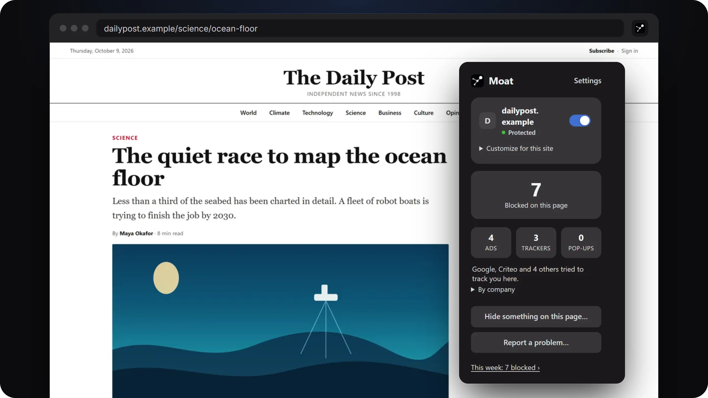

<h1>
  
  &nbsp;Moat
</h1>

**A free ad blocker for Chrome and Firefox that keeps pages clean and keeps your browsing to
yourself.** Moat stops ads, trackers and pop-ups before they load. It needs no account and
sends nothing about you anywhere.

[](https://github.com/Samuelabhinav37/moat/actions/workflows/ci.yml)
[](https://github.com/Samuelabhinav37/moat/releases/latest)
[](LICENSE)

[Website](https://samuelabhinav37.github.io/moat/) · [Install](#install) ·
[Privacy](PRIVACY.md) · [Questions](#questions)

<p align="center">
  
  <br>
  <sub>The same page without Moat and with it. The Daily Post is a demo site; the blocking is real.</sub>
</p>

## What Moat does

### Clean pages from the first click

Moat blocks ads, trackers and pop-ups as each page loads, so there's nothing to set up. Click its
icon to see what it stopped on the page you're on, or switch it off for a site that doesn't work
right.

<p align="center"></p>

### See who was following you

Settings shows which companies tried to track you this week, how many of the sites you visited
they were on, and why they wanted to.

<p align="center"></p>

### Dangerous pages stop before they open

Moat checks every page against phishing, malware and scam lists that update every day. A fake
sign-in page never gets the chance to load.

<p align="center"></p>

### Know at a glance that you're protected

The Safety check says whether everything that keeps you safe is on, and fixes anything that
isn't with one click.

<p align="center"></p>

### And more

- **Cookie banners** are answered for you, with optional cookies turned off.
- **Hide anything the lists miss**: click the Moat icon, then **Hide something on this page**.
- **Choose how much to block**: Light, Balanced (the default) or Strict.
- **Report a problem** in a few clicks, and see exactly what gets sent first.
- **Back up your settings** to a file, or sync them through your browser.
- Works in **English, Spanish, French and German**.

## Install

Moat is on its way to the Chrome Web Store and Firefox Add-ons. Until then, you can install it
from this page in about a minute.

**Chrome, Edge or Brave**

1. Download `chrome.zip` from the [latest release](https://github.com/Samuelabhinav37/moat/releases/latest)
   and unzip it.
2. Open `chrome://extensions` and turn on **Developer mode** (top right).
3. Click **Load unpacked** and choose the unzipped folder.
4. Pin Moat to your toolbar: click the puzzle piece, then the pin next to Moat.

**Firefox**

1. Download `firefox.zip` from the [latest release](https://github.com/Samuelabhinav37/moat/releases/latest)
   and unzip it.
2. Open `about:debugging#/runtime/this-firefox` and click **Load Temporary Add-on**.
3. Choose `manifest.json` in the unzipped folder. Firefox removes it when it restarts, until the
   Firefox Add-ons listing is live.

Needs Chrome 137, Firefox 140 or Firefox for Android 142, or later.

<details>
<summary><strong>Build it from source</strong></summary>

You'll need [Node.js](https://nodejs.org/) 24 or later.

```sh
git clone https://github.com/Samuelabhinav37/moat.git
cd moat
npm ci
npm run filters:update   # download the filter lists
npm run build            # builds dist/chrome and dist/firefox
```

Then load `dist/chrome` or `dist/firefox/manifest.json` as above.

</details>

## Privacy

- **No account.** Install it and it works.
- **No tracking of you.** No analytics and no crash reports.
- **Blocking happens in your browser.** Pages you visit aren't sent anywhere to be checked.
- **Signed daily updates.** Filter fixes and danger lists are checked against a signature before
  Moat uses them, and downloading them says nothing about you.
- **Reports only when you send one**, and you see what's in it first.

The full details are in the [privacy policy](PRIVACY.md).

## Questions

**Is Moat free?**
Yes. There's no paid version and no subscription. The code is open source under GPL-3.0.

**Will it break websites?**
Rarely. If a site doesn't work right, click the Moat icon and switch it off for that site. Every
other site stays protected. Reporting the problem helps fix it for everyone.

**Why does it need to read every site?**
To block ads and trackers on a page, it has to see the page's requests. That happens inside your
browser and isn't recorded or sent anywhere. [Overview](docs/overview.md#permissions) explains
each permission.

**Something got through. What should I do?**
Click the Moat icon, then **Report a problem**, or
[open an issue](https://github.com/Samuelabhinav37/moat/issues/new/choose). Security problems go
[here, privately](https://github.com/Samuelabhinav37/moat/security/advisories/new).

More answers are in the [website FAQ](https://samuelabhinav37.github.io/moat/#faq).

## For developers

```sh
npm run typecheck        # types
npm test                 # unit tests
npm run lint             # ESLint
npm run build            # dist/chrome and dist/firefox
npm run dev:chrome       # rebuild on change (also dev:firefox)
```

- [Overview](docs/overview.md): every feature, the permissions, known limitations and
  third-party data
- [Design notes](docs/design-notes.md): how blocking, the pop-up firewall and cosmetic filtering
  work
- [Enterprise](docs/enterprise.md), [Releasing](docs/RELEASING.md), [Changelog](CHANGELOG.md)
- [Contributing](CONTRIBUTING.md) and the [Code of Conduct](CODE_OF_CONDUCT.md)

## License

Moat is released under the [GPL-3.0](LICENSE) license. Third-party filter lists and data keep
their own licenses, listed in [NOTICE.md](NOTICE.md).
