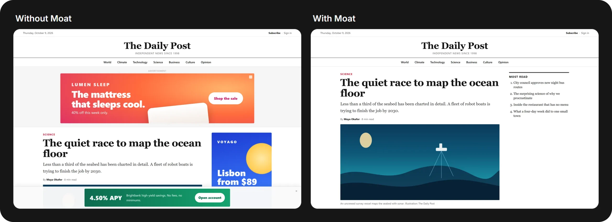

<p align="center">
  <a href="https://samuelabhinav37.github.io/moat/"></a>
</p>

<p align="center">
  <a href="https://github.com/Samuelabhinav37/moat/actions/workflows/ci.yml"></a>
  
  
  
</p>

<p align="center">
  <a href="https://samuelabhinav37.github.io/moat/"><strong>Website</strong></a> ·
  <a href="https://samuelabhinav37.github.io/moat/#how">How to use it</a> ·
  <a href="https://samuelabhinav37.github.io/moat/#faq">FAQ</a> ·
  <a href="PRIVACY.md">Privacy</a> ·
  <a href="CHANGELOG.md">Changelog</a>
</p>

Moat stops ads and trackers before they load, so pages arrive clean and quick. It answers cookie
banners for you, closes pop-up tabs that hijack your clicks, and does it all inside your browser.
No account. No telemetry.

> **Coming soon** to the Chrome Web Store and Firefox Add-ons. Until then you can
> [install it from source](#install-it-today) in a few minutes.

## Just the page you came for

<p align="center">
  
</p>

<p align="center"><sub>The Daily Post is a demo site. The blocking is real Moat.</sub></p>

## Meet the cast

<table>
  <tr>
    <td width="50%" valign="top">
      
      <strong>Ads, gone.</strong><br>
      Blare is the ad that shouts over the page. Moat stops it before it loads, and the empty box it
      leaves behind folds away.
    </td>
    <td width="50%" valign="top">
      
      <strong>Nobody follows you around.</strong><br>
      Crumb is the tracker that follows you from site to site and writes down what you do. Moat
      blocks it, and shows you which companies tried.
    </td>
  </tr>
  <tr>
    <td width="50%" valign="top">
      
      <strong>Cookie banners, answered for you.</strong><br>
      Nag asks you to accept everything, on every site. Moat finds the banner, turns optional cookies
      off and closes it.
    </td>
    <td width="50%" valign="top">
      
      <strong>No surprise tabs.</strong><br>
      Popsy sneaks a new tab open when you click. Moat closes hijacked pop-ups and fake prize pages the
      moment they appear.
    </td>
  </tr>
</table>

## How to use it

Moat works on its own. When a site breaks or an ad gets through, here's what to do.

| When | Do this |
| --- | --- |
| A site breaks | Click the **Moat icon** and turn off the switch next to the site's name. Every other site stays protected. |
| Something slips through | Click the **Moat icon**, then **Hide something on this page**, and click the thing you want gone. |
| You want more or less blocking | Open **Settings › Protection** and pick **Light**, **Balanced** or **Strict**. Extras each have their own switch. |
| Something's off | Click the **Moat icon**, then **Report a problem**. You see exactly what gets sent first. |

Settings also shows what Moat did for you: who tried to track you and why, the sites with the most
blocks, and a **Safety check** that says whether everything that keeps you safe is on.

## Private by design

- **No account.** Install it and it works. No sign-up, no email, no login.
- **No telemetry.** No analytics and no crash reports. Nothing reaches the developer unless you send
  a report.
- **Blocking runs in your browser.** The filter lists live inside the extension and run in the
  browser's own blocking engine.
- **Signed updates.** Daily filter fixes and phishing, malware and scam lists are signed. Moat checks
  the signature before using them, and those downloads carry nothing about you.
- **Open source.** GPL-3.0. Anyone can read the code, build it and compare it with what they installed.

Every case is spelled out in the [privacy policy](PRIVACY.md).

## Install it today

You'll need [Node.js](https://nodejs.org/) 24 or newer.

```sh
git clone https://github.com/Samuelabhinav37/moat.git
cd moat
npm ci
npm run filters:update   # download the filter lists
npm run build            # builds dist/chrome and dist/firefox
```

Then load it into your browser:

- **Chrome, Edge or Brave:** open `chrome://extensions`, turn on **Developer mode**, click
  **Load unpacked** and choose the `dist/chrome` folder.
- **Firefox:** open `about:debugging#/runtime/this-firefox`, click **Load Temporary Add-on** and
  choose `dist/firefox/manifest.json`. Firefox removes temporary add-ons when it restarts. A
  permanent install will come with the Firefox Add-ons listing.

## Questions and problems

- A site breaks, or an ad gets through? Use **Report a problem** in Moat's popup, or
  [open an issue](https://github.com/Samuelabhinav37/moat/issues/new/choose).
- Found a security problem? Please report it
  [privately](https://github.com/Samuelabhinav37/moat/security/advisories/new), not as an issue.
- Is it free, how does it make money, why does it need to read every site? See the
  [FAQ](https://samuelabhinav37.github.io/moat/#faq).

---

## For developers

```sh
npm run typecheck        # types
npm test                 # unit tests
npm run lint             # ESLint
npm run build            # both browsers
npm run lint:firefox     # web-ext lint (4 known warnings, 0 errors)
npm run dev:chrome       # rebuild on change (also dev:firefox)
npm run zip              # chrome.zip / firefox.zip for store upload
```

CI runs these on every push. Pushing a `vX.Y.Z` tag builds a draft release, and store submission
runs from that tag; see [`docs/RELEASING.md`](docs/RELEASING.md). Contributions are welcome: start
with [`CONTRIBUTING.md`](CONTRIBUTING.md). How the blocking, the pop-up firewall, cosmetic filtering
and each opt-in feature work is in [`docs/design-notes.md`](docs/design-notes.md).

<details>
<summary><strong>Everything Moat does, in technical detail</strong></summary>

- **Network blocking.** ~314,000 filter entries, packed into ~72,000 `declarativeNetRequest`
  rules, from 11 bundled AdGuard filter lists (ads, trackers, malicious/phishing/scam domains,
  cookie notices, annoyances), plus three independent third-party sources for redundant coverage
  (a daily-updated scam-domain list, a community ad/tracker/malware aggregate, and a longstanding
  ad-server list), plus a few first-party ones (GPC header, URL-tracking gaps, tracker coverage
  gaps).
- **Pop-up and redirect firewall.** Silently drops hijacked new-tab pop-ups and redirects, with a
  background-tab safety net for anything that slips past.
- **Cosmetic filtering.** Hides leftover ad boxes and cookie banners network blocking can't reach,
  including procedural (`:has-text` / `:xpath` / `:upward`) rules a plain stylesheet can't express.
- **Auto-reject cookie banners** (on by default). Clicks "reject" on the major consent platforms
  through a declarative rule format, never injected JS.
- **Insights.** Who tracked you (by company, from Ghostery's TrackerDB) and why, the week's busiest
  days and the sites behind them, blocks per site, and the pages Moat stopped. Ads / Trackers /
  Pop-ups split is Chrome only.
- **Safety check.** Moat on, dangerous-site lists on and current, leaked-password warnings, paused
  sites, Never block, and recent restores from a file, each with a one-click fix.
- **Element picker.** Hides anything the lists miss, permanently or just once, or grays it out if
  hiding breaks the layout.
- **Grayed-out video ads.** Dims YouTube in-stream ads that can't be blocked outright.
- **No "you're using an ad blocker" walls from Admiral.** Its bootstrap is stopped before it loads
  anything, so there's no detection, no wall and no "recovered" ads. Skipped on paused sites.
- **Feed ad removal** (opt-in). Removes sponsored posts from Instagram, LinkedIn and YouTube feeds.
- **Uncloak disguised trackers** (opt-in). Resolves CNAME-cloaked subdomains and blocks the ones
  that lead to a tracker: anything on AdGuard's CNAME list or already blocked by Moat's own tracker
  and ad lists (Firefox via its DNS API; Chrome via a public DoH lookup). Skipped on paused sites.
- **Privacy switches** (opt-in, on in Strict). Fingerprint resistance, cross-site cookie blocking,
  WebRTC leak protection.
- **Global Privacy Control.** Sends `Sec-GPC`, a legally binding opt-out signal in a dozen US states.
- **Warn about leaked passwords** (opt-in). HaveIBeenPwned k-anonymity: only a 5-character hash
  prefix leaves the device.
- **Levels and your own rules.** Light / Balanced / Strict (Balanced by default), per-list switches,
  and your own Always block / Never block lists. Dangerous-site lists outrank Never block and pausing.
- **Per-site pause, a keyboard shortcut, backup and restore with a preview and Undo, opt-in sync,
  and Report a problem.**
- **Enterprise-managed policy** via Chrome's `ExtensionSettings` or Firefox's `policies.json`. See
  [`docs/enterprise.md`](docs/enterprise.md).
- **Languages.** English, plus provisional translations for Spanish, French and German.

One codebase builds for Chrome and Firefox. The Firefox build also targets **Firefox for Android**
(`gecko_android`, min version 142) with no separate build.

</details>

<details>
<summary><strong>Permissions, and why each one is needed</strong></summary>

| Permission | Why |
| --- | --- |
| `<all_urls>` (host permission) | So the content-script firewall runs on every page and `declarativeNetRequest` can act on every request. |
| `webNavigation` | Detect when a page spawns a new tab or window, and when a page finishes loading. |
| `declarativeNetRequest` | The core network-blocking engine. |
| `declarativeNetRequestFeedback` | Chrome only, read-only match feedback for the popup's breakdown (`getMatchedRules`). |
| `storage` | Settings, paused sites and the week's counts, stored locally only. |
| `privacy` | Used only by the opt-in privacy switches; inert unless one is on. |
| `alarms` | Schedules the daily signed list refresh. |
| `dns` (Firefox only) | CNAME resolution for "Uncloak disguised trackers"; inert unless that switch is on. |
| `webRequest` + `webRequestBlocking` (Firefox only) | Cancel a request once its resolved CNAME target matches a known tracker. |
| `webRequest` (Chrome only, non-blocking) | Observes candidate requests for "Uncloak disguised trackers". Inert unless that switch is on. |
| `scripting` | Registers the optional content scripts only for the sites each applies to; injects cosmetic CSS; runs the element picker only when you click "Hide something on this page". |
| `contentSettings` | Sets the camera, microphone and location default to "block" for the opt-in permission guard. Chrome only. Inert unless that switch is on. |
| `browsingData` | Backs the popup's manual "Clear site data" button, scoped to the current site. Never called automatically. |
| `favicon` (Chrome only) | Shows each site's icon beside it in Settings lists, read from Chrome's own local icon cache. No network request. |

</details>

<details>
<summary><strong>Known limitations</strong></summary>

- **The Ads / Trackers / Pop-ups split and by-company detail are Chrome only.** Firefox hasn't
  shipped `declarativeNetRequest.getMatchedRules`. The pop-up and redirect firewall count still
  works there.
- **CNAME uncloaking is weaker on Chrome than Firefox.** Chrome has no DNS API for extensions, so it
  uses a public DoH lookup (Cloudflare) and can't block the very first request to a newly found
  cloaked tracker in a session. Firefox's path blocks every request with no third party involved.
- **The YouTube dimmer and feed scanner are DOM heuristics** and can stop matching when a site
  changes its markup. Both are switchable; the feed scanner is off by default and English only.
- **Browsers cap how many blocking rules an extension can use.** Moat's lists pack ~314,000 filter
  entries into ~72,000 rules; the default level (Balanced) needs ~68,000. When they don't all fit,
  `filterGroups.ts` turns on the most important lists that do (ads first, annoyance lists last),
  and Settings › Protection › Lists shows which were left out.
  - **Chrome** shares a pool of about 330,000 rules between all extensions (~30,000 guaranteed
    each). Balanced fits on its own; other rule-heavy extensions can crowd it.
  - **Firefox** gives each extension 30,000. On Balanced, Moat keeps the ads, trackers, pop-up,
    scam and badware lists and leaves out link tracking and the bundled malware and phishing
    lists. The daily malware and phishing lists stay on, since they don't count toward the limit.
- **`web-ext lint` reports 4 expected warnings, 0 errors**: a false-positive coinminer hit on a
  blocked domain name, plus feature-detected references to Chrome-only debug APIs.

</details>

<details>
<summary><strong>Licensing and third-party data</strong></summary>

Moat's own code is [GPL-3.0](LICENSE), matching the bundled AdGuard/EasyList/uBlock Origin/
[HaGeZi](https://github.com/hagezi/dns-blocklists)/[oisd](https://github.com/sjhgvr/oisd)
filter data so the whole package sits under one copyleft license. Full third-party license texts
are in [`NOTICE.md`](NOTICE.md), which ships inside the extension package itself.

- **Company names** in the by-company breakdown come from
  [Ghostery's TrackerDB](https://github.com/ghostery/trackerdb),
  [CC-BY-NC-SA-4.0](https://creativecommons.org/licenses/by-nc-sa/4.0/): non-commercial use only.
  Compliant because Moat has no ads, paid tier or monetary compensation tied to it; that would need
  revisiting before any future monetization.
- **Cookie-banner rules** are vendored from [Consent-O-Matic](https://github.com/cavi-au/Consent-O-Matic)
  (Aarhus University CAVI), MIT. Moat's interpreter is written from scratch against their schema.
- **CNAME-cloak destinations** come from
  [AdGuard's cname-trackers list](https://github.com/AdguardTeam/cname-trackers), MIT, plus two
  domains from NextDNS's former list, MIT.
- **Peter Lowe's ad and tracking server list** ([pgl.yoyo.org](https://pgl.yoyo.org/adservers/))
  publishes no explicit redistribution license; it's used with attribution per NOTICE.md.

</details>

## More

- [`docs/design-notes.md`](docs/design-notes.md): how everything works, the "problems we hit" log,
  and what's deliberately not built.
- [`docs/enterprise.md`](docs/enterprise.md): managed-policy deployment.
- [`PRIVACY.md`](PRIVACY.md), [`NOTICE.md`](NOTICE.md), [`CHANGELOG.md`](CHANGELOG.md).
- [`CONTRIBUTING.md`](CONTRIBUTING.md), [`CODE_OF_CONDUCT.md`](CODE_OF_CONDUCT.md) and
  [`SECURITY.md`](SECURITY.md).
