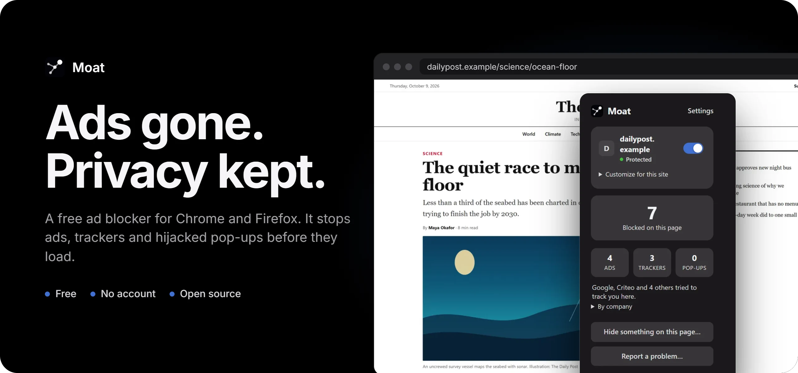
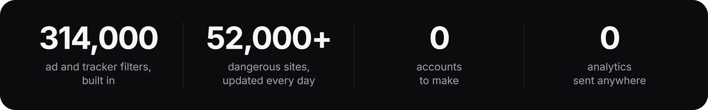
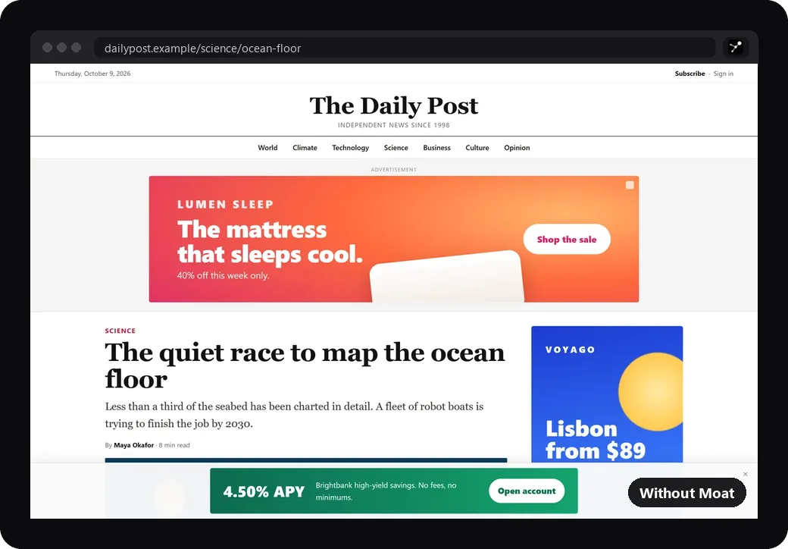
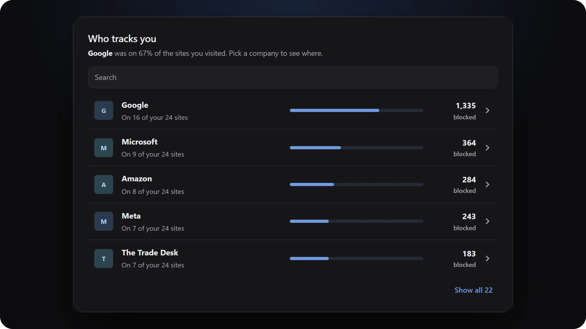
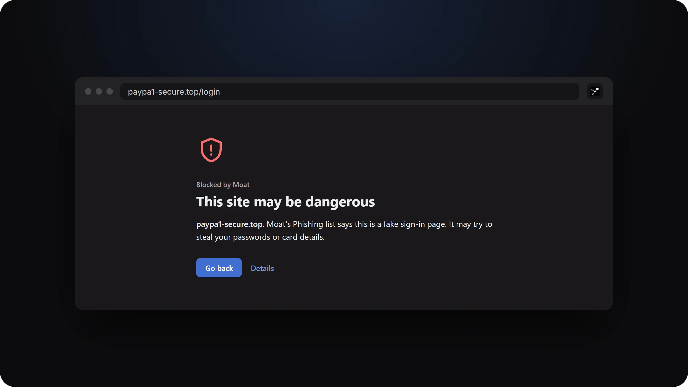
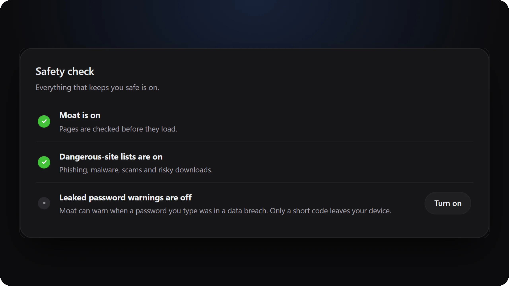

<p align="center">
  <a href="https://samuelabhinav37.github.io/moat/"></a>
</p>

<p align="center">
  <a href="#install"></a>&nbsp;
  <a href="#install"></a>&nbsp;
  <a href="https://samuelabhinav37.github.io/moat/"></a>
</p>

<p align="center">
  <a href="https://github.com/Samuelabhinav37/moat/releases/latest"></a>
  <a href="https://github.com/Samuelabhinav37/moat/actions/workflows/ci.yml"></a>
  <a href="LICENSE"></a>
</p>

<p align="center"></p>

## Just the page you came for

Moat works as soon as it's installed. On a live sports-streaming page, it cut the ad and tracking
servers that loaded from **264 to 18**. On a news site, the article starts right under the menu.

<p align="center">
  <picture>
    <source media="(prefers-reduced-motion: reduce)" srcset="docs/images/readme-wipe-still.webp">
    
  </picture>
  <br>
  <sub>The Daily Post is a demo site. The blocking is real Moat.</sub>
</p>

## What you get

### See who was following you

Settings shows which companies tried to track you this week, how many of your sites they were on,
and what they wanted.

<p align="center"></p>

### Dangerous pages stop before they open

Every page is checked against phishing, malware and scam lists that update every day. A fake
sign-in page never gets the chance to load.

<p align="center"></p>

### Know at a glance that you're protected

The Safety check says whether everything that keeps you safe is on, and fixes anything that isn't
with one click.

<p align="center"></p>

### And more

- **Click the Moat icon** to see what it stopped on any page, or switch it off for a site that
  doesn't work right. Every other site stays protected.
- **Cookie banners answered for you**, with optional cookies turned off.
- **Pop-up tabs that hijack your clicks are closed** before you see them.
- **Hide anything the lists miss**: click the Moat icon, then **Hide something on this page**.
- **Choose how much to block**: Light, Balanced (the default) or Strict.
- **Report a problem** in a few clicks, and see exactly what gets sent first.
- In **English, Spanish, French and German**.

## Install

Moat is on its way to the Chrome Web Store and Firefox Add-ons. Until then it takes about a minute
to install from here.

**Chrome, Edge or Brave**

1. Download **`chrome.zip`** from the [latest release](https://github.com/Samuelabhinav37/moat/releases/latest)
   and unzip it.
2. Open `chrome://extensions` and turn on **Developer mode** (top right).
3. Click **Load unpacked** and choose the unzipped folder.
4. Pin Moat: click the puzzle piece in the toolbar, then the pin next to Moat.

**Firefox**

1. Download **`firefox.zip`** from the [latest release](https://github.com/Samuelabhinav37/moat/releases/latest)
   and unzip it.
2. Open `about:debugging#/runtime/this-firefox` and click **Load Temporary Add-on**.
3. Choose `manifest.json` in the unzipped folder. Until the Add-ons listing is live, Firefox
   removes it when it restarts.

Works in Chrome 137, Firefox 140 and Firefox for Android 142, or later.

<details>
<summary><strong>Build it from source</strong></summary>

You'll need [Node.js](https://nodejs.org/) 24 or later.

```sh
git clone https://github.com/Samuelabhinav37/moat.git
cd moat
npm ci
npm run filters:update   # download the filter lists
npm run build            # builds dist/chrome and dist/firefox
```

Then load `dist/chrome` or `dist/firefox/manifest.json` as above.

</details>

## Private by design

- **No account.** Install it and it works.
- **No analytics** and no crash reports.
- **Blocking happens in your browser.** The pages you visit aren't sent anywhere to be checked.
- **Signed daily updates.** Moat checks the signature on every list update before using it, and
  downloading one says nothing about you.
- **Reports only when you send one**, and you see what's in it first.
- **Open source**, so anyone can read the code and build it themselves.

Every case is spelled out in the [privacy policy](PRIVACY.md).

## Questions

**Is Moat free?**
Yes. There's no paid version and no subscription. The code is open source under GPL-3.0.

**Will it break websites?**
Rarely. If one doesn't work right, click the Moat icon and switch it off for that site. Every other
site stays protected. Reporting the problem helps fix it for everyone.

**Why does it need to read every site?**
To block ads and trackers on a page, it has to see the page's requests. That happens inside your
browser and isn't recorded or sent anywhere. The [overview](docs/overview.md#permissions) explains
each permission.

**Something got through. What should I do?**
Click the Moat icon, then **Report a problem**, or
[open an issue](https://github.com/Samuelabhinav37/moat/issues/new/choose). Fixes often reach every
copy within a day, without an update. Security problems go
[here, privately](https://github.com/Samuelabhinav37/moat/security/advisories/new).

More answers are in the [website FAQ](https://samuelabhinav37.github.io/moat/#faq).

## For developers

```sh
npm run typecheck        # types
npm test                 # unit tests
npm run lint             # ESLint
npm run build            # dist/chrome and dist/firefox
npm run dev:chrome       # rebuild on change (also dev:firefox)
```

- [Overview](docs/overview.md): every feature, the permissions, known limitations and third-party
  data
- [Design notes](docs/design-notes.md): how blocking, the pop-up firewall and cosmetic filtering
  work
- [Enterprise](docs/enterprise.md), [Releasing](docs/RELEASING.md), [Changelog](CHANGELOG.md)
- [Contributing](CONTRIBUTING.md) and the [Code of Conduct](CODE_OF_CONDUCT.md)

## License

Moat is released under the [GPL-3.0](LICENSE) license. Third-party filter lists and data keep
their own licenses, listed in [NOTICE.md](NOTICE.md).
