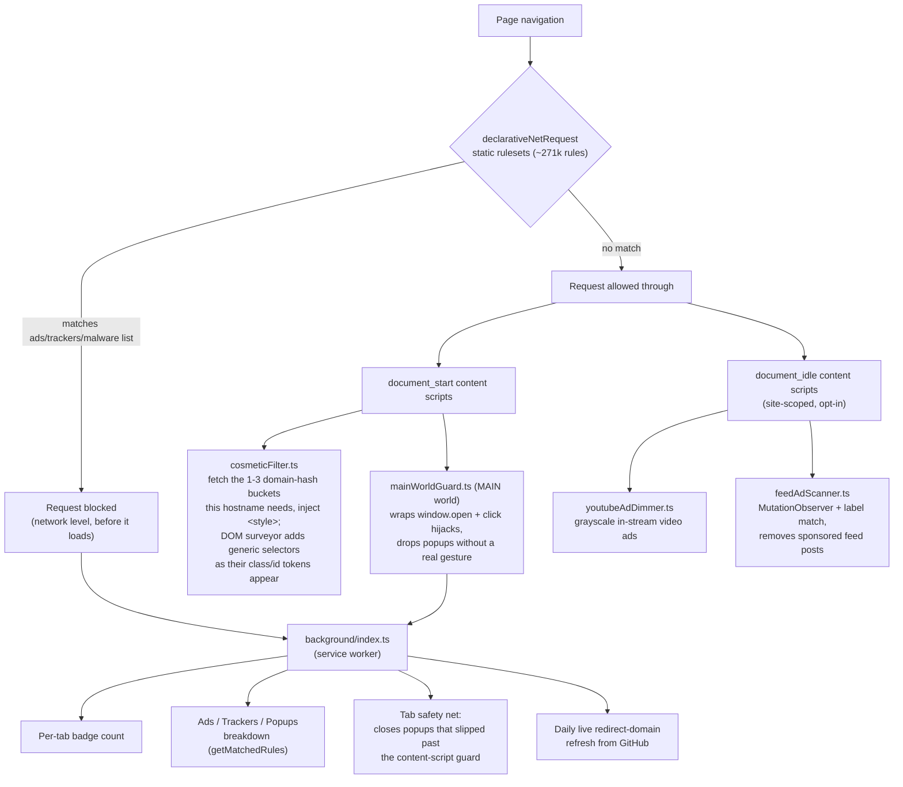

# Design notes

Deeper mechanics and rationale that used to live in the README. Nothing here is
required to build, run, or evaluate Moat — the [README](../README.md) covers that.
This is the "why it works the way it does" layer, kept so the same investigations
don't happen twice.

## Contents

- [Architecture at a glance](#architecture-at-a-glance)
- [How it works](#how-it-works)
- [Source layout and the testing pattern](#source-layout-and-the-testing-pattern)
- [Feature mechanics](#feature-mechanics)
  - [Grayed-out video ads](#grayed-out-video-ads)
  - [Aggressive feed ad removal](#aggressive-feed-ad-removal)
  - [Auto-reject cookie banners](#auto-reject-cookie-banners)
  - [Uncloak disguised trackers (Firefox)](#uncloak-disguised-trackers-firefox)
  - [Opt-in fingerprint resistance](#opt-in-fingerprint-resistance)
  - [Cosmetic filtering internals](#cosmetic-filtering-internals)
  - [Rule-match logger](#rule-match-logger)
- [Problems we hit and how we solved them](#problems-we-hit-and-how-we-solved-them)
- [Researched but not built yet — full reasoning](#researched-but-not-built-yet--full-reasoning)

## Architecture at a glance

Network-level blocking (left branch) happens before a request ever loads. Everything else is
reactive to a page that already loaded — cosmetic hiding, the popup guard, and the opt-in
per-site features all run as content scripts, while the background service worker owns anything
that needs to persist across pages (the badge, the breakdown, the safety net, live updates).

## How it works

The parts that need more than a sentence. Feature-level mechanics — the feed scanner, the consent
interpreter, CNAME uncloaking, the fingerprint noise, the cosmetic-filtering internals — have
their own sections further down.

- **Network blocking** — ships `declarativeNetRequest` static rulesets refreshed from
  `@adguard/dnr-rulesets`: 11 AdGuard lists (Base, Tracking Protection, URL Tracking, and Popups
  for ads/trackers; Online Malicious URL, Phishing URL, Scam, and Badware-risks for actual
  malware/phishing domains — the "firewall" half, which blocks known-bad sites outright, not just
  ads; Social Media, Cookie Notices, and Other Annoyances for the rest), plus four small
  first-party rulesets: the `Sec-GPC` header rule (`ruleset_privacy-headers`), ClearURLs-gap
  URL-tracking params (`ruleset_url-tracking-extra`), block rules for a handful of
  error-reporting and social ad/conversion endpoints the bundled lists miss
  (`ruleset_trackers-extra`), and domain-agnostic regex rules that catch server-side/proxied
  Google Analytics by its wire format rather than any specific host
  (`ruleset_server-side-analytics.json`, see `scripts/lib/serverSideAnalyticsRules.mjs`).
  ~271,000 rules across 21 rulesets, well under the ceiling for most
  installs (see the README's "Known limitations"), all running in the browser engine, not a JS
  handler (which MV3 no longer allows for blocking). A slice are `$redirect` rules that point ad
  scripts at a bundled no-op resource (`nooptext.js`, `1x1-transparent.gif`, etc.);
  `scripts/update-filters.mjs` vendors the ~30 resource files those rules reference out of
  `@adguard/scriptlets` into `web-accessible-resources/redirects/` so they resolve instead of
  failing closed.
- **Block-count breakdown** — the popup's Ads/Trackers/Popups strip is sourced from
  `declarativeNetRequest.getMatchedRules()` (the `declarativeNetRequestFeedback` permission),
  refreshed once per page load and mapped from the filter-list groups to three buckets. Real
  counts, starting at zero on a fresh page and filling in as the page's own requests get matched.
  Chrome-only: Firefox hasn't implemented `getMatchedRules`, so that slice stays at zero there
  while the popup/redirect firewall count still works on both browsers. A collapsed-by-default "By
  company" disclosure attributes as many matches as it can to the organization behind them,
  correlated at build time against Ghostery's TrackerDB by target domain
  (`scripts/lib/ruleCompany.mjs`), hidden entirely where TrackerDB has no data; Settings →
  Trackers shows the same list for the last tab you had open, each company with a one-sentence
  description and link (also from TrackerDB, `rules/dnr/company-info.json`). A qualitative line
  (`src/shared/protectionLevel.ts`) buckets the same count into "Light"/"Moderate"/"Heavy tracking
  blocked" — deliberately not a before/after grade, since Moat has no counterfactual for what a
  page would have loaded without it.
- **Popup/redirect firewall** — a content script injected into the page's own JS context
  (`world: "MAIN"`) wraps `window.open` and intercepts script-dispatched clicks on
  `target="_blank"` links. A new tab opens only when there's a genuine, recent, on-target user
  gesture behind it (`navigator.userActivation` plus the actual clicked element, not just "some
  click happened somewhere recently"). Everything else is dropped silently — no browser
  popup-blocked notification bar. In case one slips past the content script (a frame the script
  never ran in, a race), the background worker watches newly created tabs and silently closes any
  that land on a domain from the AdGuard Popups/URL Tracking lists.
- **Cosmetic filtering** — network blocking is network-only, so a build-time script
  (`scripts/update-cosmetics.mjs`) parses standard `##selector` / `#@#`-exception cosmetic rules
  out of the raw filter lists (skipping scriptlet and extended-selector syntax that needs a JS
  engine), validates every selector against jsdom, and buckets per-domain selectors into 64 shard
  files by a hash of the domain. A content script (`src/content/cosmeticFilter.ts`, top frame
  only) fetches only the 1–3 shards its hostname hashes into and injects them as `<style>` blocks
  at `document_start` — CSS rules, not a one-time DOM pass, so per-domain/custom/live selectors
  keep working through SPA navigation with no per-element work. This cut the JSON fetched per page
  load from ~5.8MB to under 1MB. The generic (no-hostname) selectors are indexed by a hash of
  their anchoring class/id token and injected by a self-disabling DOM surveyor
  (`src/content/cosmeticSurveyor.ts`) only as their tokens appear — details, and the sharding, are
  under "Cosmetic filtering internals" below.
- **Live updates + emergency fix channels** — the bulk of blocking stays static (MV3's
  dynamic-rule budget can't hold ~271k rules), but four small lists refresh live
  (`src/background/liveUpdates.ts`): `live/redirect-domains.json` (~460 popup/redirect domains →
  dynamic `block` rules + the popupGuard tab safety net), `live/quick-fixes.json` (an
  AdGuard-"Quick Fixes"-style channel, `block`/`allow` only — no `redirect`/`modifyHeaders`, since
  those "unsafe" DNR types can't come from a remote source), and `live/cosmetic-fixes.json`
  (`{hostname: [selector]}`, injected as plain CSS data via `background/cosmeticInject.ts`'s
  `scripting.insertCSS` on `webNavigation.onCommitted` — never a rule) all refresh on one alarm
  with an 18h freshness guard (at most ~daily). `live/youtube-quick-fixes.json` (same
  `{hostname: [selector]}` shape as `cosmetic-fixes.json`, scoped in practice to YouTube's own
  hostnames) is a **second, faster** channel on its own alarm — 60min period, 45min freshness
  guard — since YouTube's ad-slot markup churns faster than the general channel's daily cadence
  can track; this is the "Quick Fixes"-style rapid-response lane uBlock Origin is credited with
  using to keep pace on YouTube specifically. Same hash-manifest-verify (+ optional Ed25519
  signature) trust model as the other three, not a separate mechanism. All four ship empty;
  Settings shows the last check for each channel.

  **Hosting + trust.** Files are on the `gh-pages` branch, published by
  `.github/workflows/publish-live.yml` and served from GitHub Pages (10-min Cloudflare cache, no
  purge step). `LIVE_BASE_URL` is the only knob. `live/manifest.json` carries a SHA-256 of each
  payload (checked before apply — catches corruption + propagation races) and, when
  `src/shared/liveSigningKey.ts` holds a public key, a detached Ed25519 signature
  (`live/manifest.json.sig`, `src/background/liveSignature.ts`) — a manifest that doesn't verify is
  rejected, so trust rests on an offline signing key rather than the GitHub account. Signing is
  dormant until a key is set (`node scripts/gen-live-signing-key.mjs`); without it, and on engines
  without WebCrypto Ed25519, the SHA-256 check alone applies. Either way the shape validators bound
  a bad payload to "block/allow a domain set". Publishing a refresh: `npm run filters:update` +
  commit + push (the workflow deploys, no manual purge).
- **Enterprise-managed policy** — an admin can push settings org-wide via Chrome's
  `ExtensionSettings` policy or Firefox's `policies.json` `3rdparty` key (schema:
  `src/managed_schema.json`): force protection on, lock the filter-list toggles, or add an
  org-wide blocklist. Locked controls show a "Managed by your organization" badge instead of
  silently overriding the user. Full deployment details, and the optional Athena integration, are
  in [`enterprise.md`](enterprise.md).

## Source layout and the testing pattern

See `src/` for the layout: `background/` (service worker / event page), `content/`
(the content scripts — `mainWorldGuard.ts` for the page-context popup guard,
`bridge.ts` for the isolated-world relay to extension storage/messaging,
`cosmeticFilter.ts` for element hiding), `popup/` and `options/` (UI),
`shared/domainChain.ts` (the "is this hostname this domain or a subdomain of it"
check used by both the popup safety net and cosmetic filtering), `types.ts` (shared
message/settings shapes), and `scripts/manifest.ts` (builds `manifest.json` per
browser target).

`scripts/manifest.ts` emits two manifests. The Chrome one takes
`minimum_chrome_version` and a `service_worker` background; the Firefox one takes
`browser_specific_settings.gecko` (event-page background, `dns` + blocking
`webRequest` for CNAME uncloaking) **and** `gecko_android` (min version 142),
which is all Firefox for Android needs — same content scripts, same MV3 DNR
engine, no Android-specific code. `options.html` and `warning.html` (full
pages opened in a tab) carry a static `width=device-width` viewport meta so
they read on a phone. The **popup's static markup deliberately does not**: a
viewport meta or a `vw`-based width on the toolbar popup breaks Chrome's
content-sizing of it and it renders shrunk (shipped in v0.11.62, reverted in
v0.11.64). Instead `popup.ts` adds the viewport meta + a `.moat-android`
class (which the stylesheet widens `body` to `100%`) **only when
`navigator.userAgent` contains "Android"** — so desktop Chrome/Firefox never
see it, and Firefox for Android gets the full-width panel (v0.11.67; the
UA-gated form can't regress desktop the way the v0.11.62 unconditional form
did, but the Android result itself is still unverified on a real device).
There is no Chrome-for-Android target (Chrome has no extensions there) and
Safari would be a separate Xcode port.

The heuristics with the most test coverage each live in their own side-effect-free
module so they're importable without a browser environment:
`content/isPlausibleTrigger.ts` (the popup-firewall trigger check),
`background/redirectDomainMatch.ts` (the tab safety net's domain matcher), and
`content/cosmeticSelectors.ts` (which selectors apply to a given hostname) — all thin
wrappers imported by the files that actually register listeners or touch the DOM.
Same pattern for the newer additions: `shared/filterPresets.ts`,
`background/filterGroupState.ts`, `background/managedPolicyMerge.ts`, and
`shared/rulesetManifest.ts` are all pure and directly tested;
`background/filterGroups.ts`, `background/applyCustomRules.ts`, and
`background/managedPolicy.ts` are the thin browser-API wrappers around them.

## Feature mechanics

### Grayed-out video ads

YouTube's in-stream ads share the same `<video>` element as real content, so they
can't be network-blocked or cosmetically hidden without breaking the player.
`src/content/youtubeAdDimmer.ts` (YouTube-scoped, on by default) watches
`#movie_player` for two independent signals YouTube's own player already exposes —
the `ad-showing`/`ad-interrupting` class, and `.ytp-ad-module` having content — and
applies `filter: grayscale(1)` to the video while either is present. Verified live
against a real ad on a news livestream (2026-08-23). That's a first-party
observation of YouTube's own markup, not a third-party script — see the README's
"Known limitations" for why this is still best-effort despite the two-signal check.

YouTube's sidebar/in-feed "Sponsored" cards (`ytd-ad-slot-renderer` and friends) are
hidden outright instead, added as first-party selectors in
`scripts/update-cosmetics.mjs` since AdGuard's bundled ones weren't matching them
live. The element picker's "Gray out" mode uses the dimming mechanism too (a saved
selector list, `customGrayscaleRules` in Settings) for anything else hiding would
break.

### Aggressive feed ad removal

A fixed selector, static or picked, can't follow Instagram, LinkedIn, or YouTube's
infinite-scroll feeds, because all three randomize the class names on sponsored posts
specifically to defeat exactly that kind of rule (confirmed live for Instagram's
atomic CSS classes; LinkedIn has documented the same move to hashed CSS modules).
`src/content/feedAdScanner.ts` (opt-in, off by default) takes the same approach a
human would instead: a `MutationObserver` watches the feed for newly rendered posts,
and `src/content/feedAdLabel.ts` checks each one for a text node that's an exact,
case-insensitive match for "Sponsored," "Ad," "Promoted," or "Paid partnership" — per
*segment*, splitting on the separators feeds actually use between metadata (a post
header often renders as one text node reading "Sponsored · 2h", the same way an
organic post's is "username · 2h"), not a substring check, so a caption that mentions
one of those words in a sentence won't trip it. A match walks up to the nearest known
"whole post" ancestor (`article` on Instagram, `[role="listitem"]` on LinkedIn —
verified live against a real "Promoted" post, since the commonly-documented
`[data-urn]`/`.feed-shared-update-v2` selectors turned out to be stale —
`ytd-rich-item-renderer` and friends on YouTube) and hides it. Off by default because
a label match carries a little more false-positive risk than a fixed selector — for
people who want feeds fully cleaned rather than just what static rules catch.

### Auto-reject cookie banners

Cosmetic filtering already hides banners that match a plain selector, but AdGuard's
own Cookie Notices list mostly handles the "click reject for me" half via scriptlets:
arbitrary injected JS Moat deliberately never executes (see the README's
"Popup/redirect firewall" and licensing note for why that boundary matters).
`src/content/consent/` is a from-scratch interpreter for
[Consent-O-Matic](https://github.com/cavi-au/Consent-O-Matic)'s declarative rule
format instead — inert JSON describing which selector to click, never code to run,
the same trust boundary as Moat's own cosmetic selectors. Every consent category
defaults to reject (`consent/types.ts`'s `REJECT_ALL`), Consent-O-Matic's own
out-of-the-box default too, not a stricter policy invented here.

Ported by hand from their MIT-licensed source (`Tools.js`, `Matcher.js`, `Action.js`,
`CMP.js`, `ConsentEngine.js`) rather than guessed from the schema alone — two real
schema-vs-implementation mismatches were caught doing that (a documented `styleFilter`
field the actual code never reads, and `DOMSelection`'s nominally-recursive
`{parent,target}` shape only ever being resolved one level deep in practice) and
matched to what the shipped extension actually does, not what its schema
aspirationally describes. Verified end-to-end in tests against the real,
currently-vendored Cookiebot and OneTrust rules — not just unit tests of the
interpreter in isolation — confirming the default-reject path clicks only
"Decline"/unchecks pre-checked categories, never "Accept" (see
`src/content/consent/engine.test.ts`).

Deliberately narrower than upstream in a few places, each explained in that
directory's file headers: no drag-simulated consent sliders, `close` is a safe no-op
rather than `window.close()` (this only ever runs in the page's own tab, not a popup
window), and no progress-dialog/PIP visual chrome, since Moat has nowhere it would
show. Opt-in, off by default — it's still clicking things on your behalf, closer in
kind to the aggressive feed scanner than to plain cosmetic hiding. Covers a few dozen
of the most widely-reused consent platforms (`rules/dnr/consent-rules.json`, vendored
by `scripts/vendor-consent-rules.mjs`), not Consent-O-Matic's separate 200+ per-site
bespoke rule catalog.

### Uncloak disguised trackers (Firefox)

A CNAME-cloaked tracker hides behind a subdomain of the site you're on (e.g.
`trk.example.com`) that secretly resolves elsewhere via DNS, specifically to defeat
domain-based blocking — the static rules never see the real destination, only the
disguised first-party-looking hostname. Chrome has no DNS-resolution API for
extensions at all, a hard platform gap; Firefox exposes `dns.resolve()`, the same API
uBlock Origin uses there for the same purpose.

`src/background/cnameUncloak.ts` adds a blocking `webRequest.onBeforeRequest` listener
(Firefox still allows this under MV3; Chrome no longer does) that, for a subresource
request whose hostname shares the current page's own domain (the actual cloaking
pattern — a true third-party domain is already visible to and blockable by the static
rules directly, so it's skipped, no DNS lookup needed), resolves the real canonical
name and cancels the request if it leads into a known tracker destination
(`rules/dnr/cname-cloak-destinations.json`, vendored from
[NextDNS's public list](https://github.com/nextdns/cname-cloaking-blocklist)).
Firefox's blocking listeners can return a `Promise` (supported since Firefox 52), so
this resolves DNS per-candidate-request directly rather than needing a separate
cache-warming pass. Off by default: it's a per-request DNS resolution with a
different cost/trust profile than everything else.

### Opt-in fingerprint resistance

A toggle, off by default: deterministic per-install noise on canvas
(`toDataURL`/`toBlob`/`getImageData`) and `AudioBuffer.getChannelData` reads, a
generic WebGL vendor/renderer string in place of your real GPU, and
`navigator.hardwareConcurrency`/`deviceMemory` rounded to common values.
"Deterministic" matters here: the same canvas content on the same install always
noises the same way, so a site re-reading it twice can't tell anything changed — but
different installs get different noise, which is what actually defeats cross-site
fingerprint correlation. Off by default because, unlike blocking, this is the one
feature that can occasionally change what a page observes (e.g. a canvas-based
CAPTCHA).

A second, nested opt-in — **rotate noise every browser session** — switches the seed
from the permanent per-install one to one stored in `browser.storage.session`
(in-memory, cleared on browser/extension restart), closer to Brave's model: a
fingerprint that never changes can itself become a durable cross-site identifier over
time, which rotating trades off against sites seeing a different "device" on every
restart. Off by default, layered under the parent toggle rather than replacing it,
since the deterministic default is the safer one for compatibility. Content scripts
can't reach `storage.session` until the background worker grants it access
(`storage.session.setAccessLevel`, called once at startup); on the rare page load
that races that call, this silently falls back to the permanent seed rather than
failing (`src/content/bridge.ts`).

### Cosmetic filtering internals

A build-time script (`scripts/update-cosmetics.mjs`) downloads the raw filter-list
text — 7 AdGuard lists plus uBlock Origin's "Annoyances – others" list taken for its
cosmetic rules only (no network rules, so no DNR-budget impact) — parses standard
`##selector`/`#@#`-exception cosmetic rules, AdGuard's `#$#`/`#@$#` CSS-injection
syntax, **and procedural (extended-selector) rules** — `:has-text()`, `:matches-css()`,
`:xpath()`, `:upward()`, `:min-text-length()`, `:remove()` — into a task-chain shape
(`scripts/lib/parseProceduralSelector.mjs`) that `src/content/proceduralCosmetic.ts`
evaluates against the live DOM at runtime (a `<style>` tag can't express these).
Scriptlets, HTML filtering (`##^…`), and the remaining extended pseudos
(`:matches-attr`, `:style`, `+js(`, …) are still skipped — see the comment atop
`scripts/lib/parseCosmeticRules.mjs`. Every surviving plain selector/declaration is
validated against jsdom so nothing invalid ships; procedural prefixes + task args go
through `src/shared/proceduralSafety.ts` (length caps, no braces/backticks/angle
brackets). Per-domain rules are
bucketed into 64 shard files by a hash of the domain name (`bucketForDomain`, kept
identical between `scripts/lib/domainBucket.mjs` and `src/shared/domainBucket.ts`,
cross-checked by a test that runs both), so a content script only ever has to fetch
the 1–3 buckets its own hostname's domain chain hashes into — a real fix, not a
micro-op: it cut the JSON fetched on every single page load from ~5.8MB to well under
1MB (see "Problems we hit" below).

**CSS injection** (measured 2026-09: 8,778 of 119,391 real cosmetic lines across
Moat's 7 bundled AdGuard lists, 7.4% — see `docs/design-notes.md`'s "Researched but
not built yet" entry on extended selectors for the full measurement) pairs a
selector with its own declaration instead of the implicit
`{display:none!important}` every hide rule shares — most commonly a cookie-banner
hide paired with an `overflow`/`position` reset that un-sticks page scroll once the
banner's gone. Still plain CSS a `<style>` tag can express, just one rule per
selector instead of one shared selector list, so it ships through the exact same
trust model as hide selectors: build-time jsdom validation (a real `selector{decl}`
parse, not a substring check), plus a fast substring blocklist
(`isSafeCssDeclarationText` in `parseCosmeticRules.mjs`) for known escape vectors
(`</style`, backtick, `@import`, `expression(`) before that. A `#@$#` exception is
bare (no declaration) and is folded into the *same* `exceptions` map `#@#` already
feeds — both just mean "don't apply whatever targets this selector here."

A content script (`src/content/cosmeticFilter.ts`, top frame only) injects the
resulting rules as `<style>` blocks at `document_start` — CSS rules, not a
one-time DOM pass, so per-domain, custom, live, and CSS-injection selectors keep
hiding elements a site adds later (SPA navigation, lazy-loaded slots) with no
per-element work. Those go into their own blocks and are injected in full.

The **generic** (no-hostname) selectors are handled differently, because injecting
all ~17k of them made the style engine re-check the whole set on every recalc and
forced a post-`load` cleanup pass (~0.5–4 s of main-thread work on a complex page).
The build (`scripts/lib/genericTokenIndex.mjs`) splits them by the hash
(`src/shared/tokenHash.ts` ↔ `scripts/lib/tokenHash.mjs`, FNV-1a, same
build/runtime-parity discipline as `domainBucket`) of each selector's anchoring
class/id token — the last class/id of its right-most compound:

- `genericByHash: Record<tokenHash, selector[]>` — ~16k selectors across ~15k
  buckets (avg ~1 selector each).
- `genericHigh: string[]` — the ~6% with no usable anchor (attribute-only, bare
  tag, pseudo-only); injected up front on every page.

`cosmeticFilter.ts` injects `genericHigh` into the generic `<style>` immediately,
then starts `src/content/cosmeticSurveyor.ts`: an initial token scan plus a
**batched `MutationObserver`** (`{childList, subtree, attributes:['class','id']}`)
that collects the class/id tokens actually present, hashes them, and appends the
`genericByHash` buckets for tokens it has seen. It self-disables once eight
consecutive flushes turn up no new selector, or after walking 100k nodes — the
backstop against a pathological mutation flood. Net effect: the style engine
evaluates the dozens of generic selectors relevant to a page instead of 17,148,
and there is no cleanup rewrite. Exceptions (`#@#` / `#@$#`) are applied to the
surveyed slice exactly as to the rest (`genericSelectorsForTokens` in
`src/content/cosmeticSelectors.ts`).

#### Collapsing the blocked ad's empty box

`src/content/adCollapse.ts`, started from the same content script, handles the
gap a network-blocked ad leaves when the page still reserves its slot height and
no cosmetic selector matched the wrapper. It is not selector-based: it does one
pass on `load` plus a delayed second (for lazy slots) over just
`iframe[src], img[src], ins.adsbygoogle`, hides any whose `src` host is on
`rules/ad-networks.json` (a hand-curated ~100-domain list of display/native/video
ad networks, each verified present in Moat's own DNR block set — checked into the
repo, not generated, and validated by `validate-rules.mjs`), plus unfilled
AdSense `<ins>` slots. For each, it walks up to three ancestors and collapses one
only if it holds nothing else rendered and was reserving space (≥ 20 px tall, or
a standard IAB box size) — never `<body>`, `<main>`, a `<section>`/`<article>`, or
a landmark role. The whole pass is wrapped so a failure can never break the page.

### Rule-match logger

A development tool, not a user feature: `logger.html` (linked from Settings → About →
Debugging) lists every request `declarativeNetRequest.onRuleMatchedDebug` saw on the
active tab and which specific rule matched it, for diagnosing a filter or heuristic
that's stopped working without guessing. Chrome only fires that event for extensions
loaded unpacked (developer mode) — it stays empty on a Web Store install, and on
Firefox, which doesn't implement it at all — so `src/background/ruleLogger.ts`
feature-detects it and the page says so plainly rather than showing an empty table
with no explanation.

## Problems we hit and how we solved them

Most of these were found by actually driving the extension in a real browser against
a real site, not by reading the DOM structure off a blog post — the sites in question
(Instagram, LinkedIn, YouTube) all obfuscate or shift their markup in ways that make
static assumptions unreliable.

| Problem | Why it happened | How we solved it |
| --- | --- | --- |
| YouTube ad dimming looked broken | The setting defaulted to **off** — nobody had opted in, no code bug | Verified live against a real ad, confirmed detection worked once enabled, flipped the default to on, and added a second independent detection signal so one YouTube markup change can't silently disable it |
| YouTube's sidebar "Sponsored" cards stayed fully visible | AdGuard's bundled cosmetic selectors didn't match YouTube's current sidebar markup | Added first-party selectors (`ytd-ad-slot-renderer` and friends) directly in `scripts/update-cosmetics.mjs` rather than waiting on an upstream filter-list update |
| The feed scanner did nothing at all on LinkedIn | Its content script's `matches` list only covered Instagram and YouTube — LinkedIn was never in scope, this wasn't a selector bug | Added LinkedIn's URL pattern to `scripts/manifest.ts` |
| The feed scanner still missed LinkedIn posts once it *was* in scope | The commonly-documented `[data-urn]` / `.feed-shared-update-v2` container selectors turned out to be stale | Live DOM inspection found the real current wrapper is `[role="listitem"]`; added it as the primary selector and kept the old two as harmless fallbacks |
| Instagram's "Sponsored" label matched inconsistently | The label shares one text node with adjacent metadata — a post header renders as a single node reading `"Sponsored · 2h"`, the same way an organic post's is `"username · 2h"` | Split on the separators these feeds actually use (bullet, middle dot, vertical bar, or `" - "`) and matched each segment exactly, instead of loosening to a substring check that could start matching prose |
| Cosmetic filtering fetched ~5.8MB of JSON on every single page load | Per-domain selector files were sharded purely by file size (`chunkBySize`), unrelated to which site was actually open — every page fetched every domain's rules | Replaced size-based chunking with domain-hash bucketing (`bucketForDomain`), so a page now fetches only the 1–3 shard files its own hostname needs — verified live against a served build: ~700KB instead of ~5.8MB for a typical page |
| Live redirect-domain updates silently stopped refreshing after the rename | The GitHub repo was made private mid-project, breaking the unauthenticated `raw.githubusercontent.com` fetch `liveUpdates.ts` relies on | Flagged rather than fixed — repo visibility is a real decision (source availability, not just this feature), left for a deliberate call rather than changed unilaterally |
| The extension wouldn't load unpacked in Chrome at all (v0.11.31–0.11.37) | `src/managed_schema.json` used `"additionalProperties": false`; Chrome's managed-storage schema compiler requires it to be a schema object, not a boolean, and rejects the whole file otherwise. Firefox's `web-ext lint` doesn't check this, so CI stayed green | Removed all three occurrences; added `src/managedSchema.test.ts` to fail if a boolean `additionalProperties` is reintroduced |

## Researched but not built yet — full reasoning

From a pass on what a more complete privacy tool would also do. The README carries a
one-line version of each; this is the full rationale so a future pass doesn't
rediscover it from scratch.

### Instagram Stories ads

The aggressive feed scanner deliberately doesn't touch these, and that's a real
scoping decision, not an oversight. Investigated live: a Stories ad renders as a
full-screen slide inside the *same* viewer component that shows real stories — there's
no separate "ad container" the way there is in the main feed. Applying the feed
scanner's usual technique (hide the matched container) to a Stories ad would blank the
entire full-screen viewer, including the real stories around it, since they all share
one container. The correct fix is a different mechanism entirely — detect the ad slide
and auto-advance past it, the way you'd tap through it manually — which is closer to
"act on the page" than "hide an element," a bigger trust/scope step than anything else
this scanner does. Not built without an explicit decision to take that step.

### Font-enumeration fingerprinting

Not covered by the fingerprint-resistance toggle — canvas, audio, WebGL, and the two
navigator hints are. This one's a real architectural gap, not just an unimplemented
feature: Brave's approach (exposing only a randomized subset of user-installed fonts)
works because Brave patches font enumeration in the browser engine's own C++ layer,
something no extension can do. The actual detection vector fingerprinters use — render
invisible text in a candidate font, compare its measured width against a fallback via
`offsetWidth`/`getBoundingClientRect` — has no dedicated, interceptable JS API the way
canvas/audio reads do; those are generic layout properties every page's ordinary code
depends on, so noising them broadly risks real site breakage in a way nothing else
Moat's fingerprint guard touches does.

### uBlock Origin's per-site dynamic-filtering "firewall matrix"

A real, shipped, sourced technique — a full matrix UI letting an "advanced user" set
global vs. per-site allow/block rules down to individual third-party domains contacted
by the current page. Explicitly declined on philosophy grounds, not technical
infeasibility: this is real decision-delegation to the user at a granularity Moat's
"decide nothing for the user by default, quiet" stance directly argues against. uBO
itself gates it behind an explicit "I am an advanced user" opt-in for the same reason.

### Ghostery's `fetch`-monkeypatching approach to dynamic request modification

MV3's `declarativeNetRequest` can't do the data-driven request rewriting (stripping
identifying params, not just block/allow) Ghostery's tracker protection relies on, so
their stated approach is replacing built-in browser APIs like `fetch` from a content
script to claw some of that back — by their own admission, this "introduces
site-breakage risks and latency." A materially bigger trust/breakage step than
anything Moat already does (including the popup firewall's `window.open` wrapper,
which only intercepts a narrow, specific call, not a page's entire networking
surface).

### Countering YouTube's ad-blocker-detection-and-playback-block escalation

`youtubeAdDimmer.ts` dims in-stream ad *content* — a narrower, safer problem than
detecting and defeating YouTube's own detection of an active blocker, which is a
separate, ongoing fight Moat doesn't attempt. Researched in
[`docs/research/ad-blocker-mechanisms-and-user-irritation-2026-09.md`](research/ad-blocker-mechanisms-and-user-irritation-2026-09.md)
§2.6: YouTube controls both the player code and the ad-serving decision server-side,
so any client-side countermeasure is permanently reacting to whatever heuristic
YouTube shipped most recently, with no way to get ahead of a change it can't see
before it ships — a materially bigger, first-party-controlled, actively-litigated
target (a formal ePrivacy complaint is pending with Ireland's DPC over the detection
script itself) than the third-party anti-adblock suppliers Moat's filter lists already
handle like any other tracker request. Declined for the same reason as the firewall
matrix and `fetch`-monkeypatching above: materially higher maintenance burden and
breakage/ToS-adjacent risk than anything else Moat does, for a fight structurally
outside a client-side extension's control.

### AdGuard/uBO "extended selector" (procedural) cosmetic filters — BUILT (v0.11.69)

Originally declined: the first measurement classified extended-selector syntax at
**7 of 119,391 lines (0.0%)** across Moat's AdGuard lists and a JS matching engine
for 7 rules wasn't justified. That measurement undercounted — it keyed on
`:contains(` and missed `:has-text(` (AdGuard's newer spelling). A re-run with the
full marker set found ~1,770 in the AdGuard lists alone, and pairing that with
uBlock Origin's "Annoyances – others" list (cosmetic rules only) brings the total to
**~2,100 procedural rules**. So it's now built: a task-chain shape at build time
(`scripts/lib/parseProceduralSelector.mjs`), a budgeted, self-disabling
MutationObserver engine at runtime (`src/content/proceduralCosmetic.ts`) reusing the
same discipline as `cosmeticSurveyor.ts`. Supported: `:has-text`/`:contains`,
`:matches-css`(+`-before`/`-after`), `:xpath`, `:upward` (n or selector),
`:min-text-length`, `:remove`. Still skipped: `:matches-attr`, `:matches-path`,
`:style`, `:watch-attr`, `+js(`, `##^…` HTML filtering. `:xpath`/`:remove` are the
new trust surface (`document.evaluate` over a filter-list string; DOM removal) —
bounded by `src/shared/proceduralSafety.ts` and the same build-time-vendored,
CSS-parser-validated list trust root as every plain selector.
